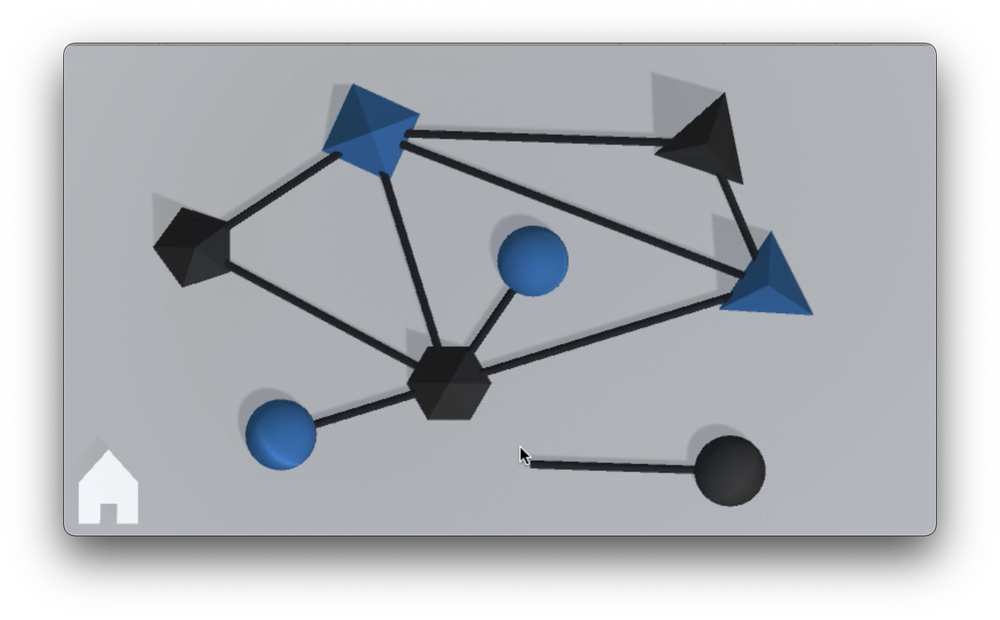

# Connect
2.5D geometry game built in C# using Unity

## Where are the rest of the files??
Game dev storage issues strike again 💔. Please feel free to download the [zip file](https://drive.google.com/file/d/1qFO5ktwH0BtOOKkS7GLEZ0Y10bzcVnq8/view?usp=sharing) containing this entire project from Google Drive. It's a Mac build, but if you're running on Windows, let me know, and I'll send a new file over.

## Screenshots
  
